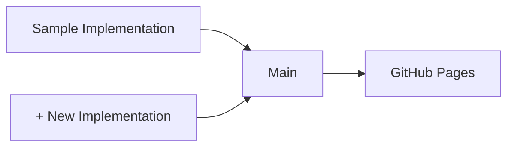

# VC JWT 2.0 Test Suite

[](https://github.com/transmute-industries/vc-jwt-test-suite/actions/workflows/report.yml)

## Implementations 
| Status                              | Name                                                                 | Link    |
|-------------------------------------|----------------------------------------------------------------------|---------|
| [](https://github.com/transmute-industries/vc-jwt-test-suite/actions/workflows/sample.yml) | Sample Implementation                                                               | [source](https://github.com/transmute-industries/vc-jwt-test-suite/tree/main/implementations/sample)    |


## Test Report Generation




## Docker Basics

```sh
docker-compose build
```

## TODO

Use act...

```sh
act -j sample --secret-file .env
```