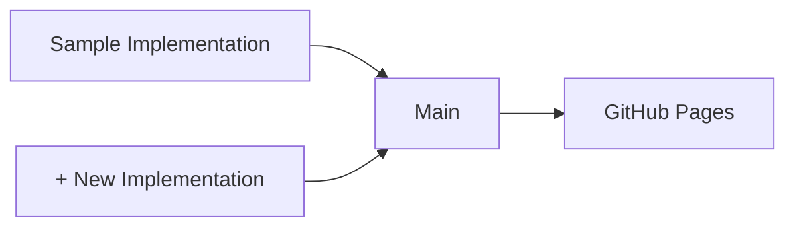

# VC JWT 2.0 Test Suite

[](https://github.com/transmute-industries/vc-jwt-test-suite/actions/workflows/report.yml)

## Test Report Generation




## Usage

```sh
npm i
npm run report:output:generate
npm run report:output:summarize
```


## Docker Basics

```sh
docker-compose build
```

### Sample Docker CLI

```sh
docker-compose run sample \
credential create \
--key /data/inputs/keys/private.key.ES384.json \
--input /data/inputs/claimsets/_minimal-credential.json \
--output /data/outputs/sample/_minimal-credential.proof.json \
--debug
```