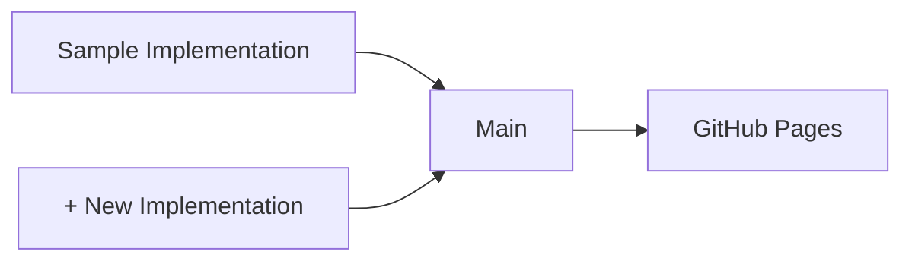

# VC JWT 2.0 Test Suite

[](https://github.com/transmute-industries/vc-jwt-test-suite/actions/workflows/report.yml)

## Test Report Generation



## Usage

```sh
npm i
npm run report:output:generate
npm run report:output:summarize
```

### Workflow

Add files to [keys](./data/inputs/keys/) and [claimsets](./data/inputs/claimsets/).

Run regenerate and shove to update report:

```sh
npm run regenerate
npm run shove
```

## Docker Basics

```sh
docker compose build
```

### Sample CLI

#### Generate Key

```sh
docker compose run sample key generate --private --alg ES384 \
--output /data/inputs/keys/private.key.ES384.json \
--debug
```

#### Issue Credential

```sh
docker compose run sample credential create \
--key /data/inputs/keys/private.key.ES384.json \
--input /data/inputs/claimsets/_minimal-credential.json \
--output /data/outputs/sample/_minimal-credential.proof.json \
--debug
```

#### Verify Credential

```sh
docker compose run sample credential verify \
--key /data/inputs/keys/private.key.ES384.json \
--input /data/outputs/sample/_minimal-credential.proof.json \
--output /data/outputs/sample/_minimal-credential.proof.verified.json \
--debug
```

#### Issue Presentation

```sh
docker compose run sample presentation create \
--key /data/inputs/keys/private.key.ES384.json \
--input /data/inputs/claimsets/_minimal-presentation.json \
--output /data/outputs/sample/_minimal-presentation.proof.json \
--debug
```

#### Verify Presentation

```sh
docker compose run sample presentation verify \
--key /data/inputs/keys/private.key.ES384.json \
--input /data/outputs/sample/_minimal-presentation.proof.json \
--output /data/outputs/sample/_minimal-presentation.proof.verified.json \
--debug
```
