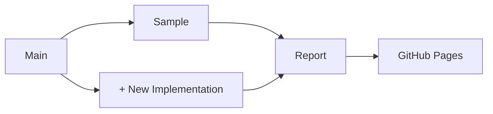

# VC JWT 2.0 Test Suite

[](https://github.com/transmute-industries/vc-jwt-test-suite/actions/workflows/report.yml)

## Implementations 
| Status                              | Name                                                                 | Link    |
|-------------------------------------|----------------------------------------------------------------------|---------|
| [](https://github.com/transmute-industries/vc-jwt-test-suite/actions/workflows/sample.yml) | sample                                                               | [source](https://github.com/transmute-industries/vc-jwt-test-suite/tree/main/implementations/sample)    |





## Docker Basics

```sh
docker-compose build
```


## Create Verifiable Credential

```sh
IMPLEMENTATION=sample
KEY=/data/inputs/keys/key-0-p256.json
INPUT=/data/inputs/claimsets/credential-0.json
OUTPUT=/data/outputs/$IMPLEMENTATION/credential-0--key-0-p256.json

docker-compose run $IMPLEMENTATION \
credential create \
--key $KEY \
--input $INPUT \
--output $OUTPUT \
--debug
```
## Verify Verifiable Credential

```sh
IMPLEMENTATION=sample
INPUT=/data/outputs/$IMPLEMENTATION/credential-0--key-0-p256.json
OUTPUT=/data/outputs/$IMPLEMENTATION/credential-0--key-0-p256.verified.json

docker-compose run $IMPLEMENTATION \
credential verify \
--input $INPUT \
--output $OUTPUT
```
